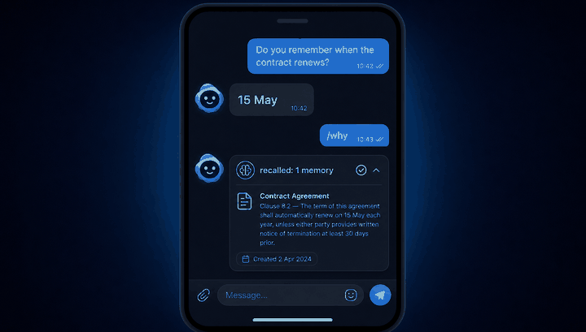
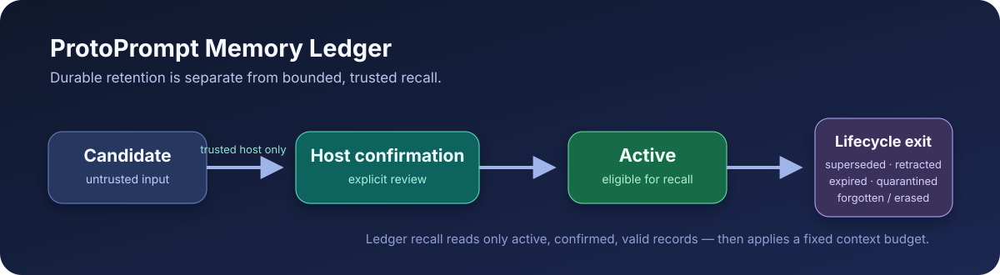

# protoprompt

[](https://github.com/Idxeed/protoprompt/actions/workflows/ci.yml)
[](https://pypi.org/project/protoprompt/)
[](https://codecov.io/gh/Idxeed/protoprompt)
[](https://www.python.org/)
[](LICENSE)
[](README.md)
[](README.en.md)

[Русская версия](README.md)

**Reliable agent memory under a fixed context budget.** ProtoPrompt is an
embeddable context runtime for LLM applications. The core combines **RAG over
documents**, **compressed session memory**, an optional **user profile**, token
budgeting, and recall provenance. Integration adapters connect the same memory
contract to bots, agents, APIs, model providers, and production storage without
coupling those dependencies to the core package.





The reference [Telegram bot](docs/en/telegram.md) persists long-term memory in
SQLite, works with OpenAI or Ollama, and explains each recall through `/why`.

## Why

Production LLM apps hit the same wall: the model needs context, but the
context window is finite. Hand-rolled prompt assembly gets messy:
documents are queried separately from session history, the system prompt
gets duplicated, and you end up rewriting the same glue code per project.

`protoprompt` separates the three concerns and gives each a clean
protocol:

- `StoreProtocol` — pluggable local and production vector storage.
- `StrategyProtocol` — how to compress old turns of a long session.
- `TokenCounter` — how to budget the final prompt.

The `ContextBuilder` orchestrates all three. The result is a single
`system_prompt` plus a structured `ContextOutput` describing what went in
(head, tail, RAG, profile) so the UI can show provenance.

The budgeted path also exposes a `ContextPlan` and request receipt, so a UI can
show exactly which blocks made the final prompt, why, and at what token cost.

The experimental `MemoryWriter` / SQLite Memory Ledger adds a separate,
host-confirmed lifecycle for durable facts, decisions, preferences, and agent
episodes. It is intentionally opt-in while adapters to legacy vector/profile
memory are built; see the [Memory Ledger guide](docs/en/memory-ledger.md).

Its experimental `LedgerRecallPlanner` is the first safe read lane for an
agent's current task: it selects only active, host-confirmed records into a
fresh, bounded JSON data envelope, provides a content-free receipt, and fails
closed if selected memory changes before send. It does not silently modify a
system prompt or replace final request accounting; see [Bounded ledger
recall](docs/en/ledger-recall.md).

Our path to 1.0 is deliberately narrow: retain information for as long as the
application needs, but admit only an explainable, policy-approved set of
blocks that fits the active context window. See the [roadmap](ROADMAP.md) for
the stable memory and context contracts this leads to.

## Install

```bash
pip install protoprompt

# With ChromaDB backend
pip install "protoprompt[chroma]"

# With tiktoken-based tokenizer
pip install "protoprompt[tiktoken]"

# Integrations: OpenAI SDK / Ollama / any OpenAI-compatible REST
pip install "protoprompt[openai]"
pip install "protoprompt[ollama]"
pip install "protoprompt[http]"
pip install "protoprompt[anthropic]"
pip install "protoprompt[google]"
pip install "protoprompt[bedrock]"
pip install "protoprompt[pydanticai]"
pip install "protoprompt[llamaindex]"
pip install "protoprompt[mcp,agents,langgraph]"
pip install "protoprompt[postgres,redis,otel]"
pip install "protoprompt[elasticsearch]"  # or opensearch
pip install "protoprompt[documents,fastapi]"
pip install "protoprompt[aws-secrets]"    # or gcp-secrets

# Vector DBs and API-free local embeddings
pip install "protoprompt[qdrant]"
pip install "protoprompt[local]"
pip install "protoprompt[fastembed]"

# Dev / docs
pip install "protoprompt[chroma,qdrant,dev]"
```

## Quickstart

```python
import asyncio
from protoprompt import (
    InMemStore,
    ContextBuilder,
    ContextInput,
    Pipeline,
    HeuristicStrategy,
    Session,
)


class MyLLM:
    async def chat(self, messages, model="", **options):
        return "stub"

    async def embed(self, texts, model=""):
        # replace with real embeddings
        return [[0.1] * 384 for _ in texts]


async def main():
    store = InMemStore()
    store.add("doc-1", ["Paris is the capital of France."], [[0.5] * 384])
    llm = MyLLM()

    builder = ContextBuilder(store, llm)
    out = await builder.build(ContextInput(
        query="What is the capital of France?",
        system_prompt="You are a geography tutor.",
        doc_ids=[1],
    ))
    print(out.system_prompt)

    pipeline = Pipeline(
        store, llm,
        strategy=HeuristicStrategy(),
        compress_every_n=10,
    )
    session = Session(chat_id="c1", messages=[
        {"role": "user", "content": "Hi"},
        {"role": "assistant", "content": "Hello!"},
    ])
    if pipeline.should_compress(len(session.messages)):
        await pipeline.compress_and_store(session)


asyncio.run(main())
```

## Architecture

```
                 +--------------------+
                 |   ContextBuilder   |
                 |   (orchestrator)   |
                 +---------+----------+
                           |
        +------------------+------------------+------------------+
        |                  |                  |                  |
        v                  v                  v                  v
+---------------+  +----------------+  +---------------+  +---------+
| RAG retrieval |  | Session memory |  | User profile  |  |  Store  |
| (vector top-k)|  | (compressed)   |  | (LLM-derived) |  |  query  |
+---------------+  +----------------+  +---------------+  +---------+
        |                  |                  |
        +--------+---------+--------+---------+
                 |                  |
                 v                  v
        +----------------+  +----------------+
        |  TokenCounter  |  |  StoreProtocol |
        |  (pluggable)   |  |  (in-mem/chroma)|
        +----------------+  +----------------+
```

## Public API

| Module                   | Exports                                                           |
|--------------------------|-------------------------------------------------------------------|
| `protoprompt`            | `Pipeline`, `ContextBuilder`, `ContextInput`, `ContextOutput`     |
| `protoprompt.store`      | `StoreProtocol`, `AsyncStoreProtocol`, `InMemStore`, `SqliteStore`, `as_async` |
| `protoprompt.session`    | `Session`, `CompressedBlock`, `HeuristicStrategy`, `LLMSummaryStrategy` |
| `protoprompt.profile`    | `UserProfile`, `ProfileBuilder`                                   |
| `protoprompt.ledger` *(experimental)* | `MemoryWriter`, `SqliteMemoryLedger`, typed lifecycle records and receipts |
| `protoprompt.tokens`     | `TokenCounter`, `RegexTokenCounter`, `TiktokenCounter`            |
| `protoprompt.llm`        | `LLMClientProtocol`                                               |
| `protoprompt.cache`      | `CachedLLMClient`, `InMemoryEmbeddingCache`                       |
| `protoprompt.hooks`      | `ContextHooks`, `PipelineHooks`                                   |
| `protoprompt.integrations` | `OpenAIClient`, `OllamaClient`, `HttpxLLMClient`, `QdrantStore`, `SentenceTransformersClient`, `FastEmbedClient` |
| `protoprompt.connectivity` | scope-pinned `MemoryService` shared by runtime adapters |
| `protoprompt.readers`      | bounded local readers and framework document converters |

Runnable recipes live in [examples/](examples/): an offline
session-compression demo, Ollama RAG, budgeted OpenAI chat, and local
embeddings.

## Documentation

Full docs are built in two languages:

- 🇷🇺 Russian: <https://idxeed.github.io/protoprompt/ru/>
- 🇬🇧 English: <https://idxeed.github.io/protoprompt/en/>

Build locally:

```bash
pip install "protoprompt[dev]"
python scripts/build_docs.py --serve  # both versions on different ports
```

## Local Ollama web chat

The repository includes a local Ollama reference UI: chat, PDF RAG, and a
durable conversation archive. It keeps the full transcript locally, but each
model call is a fresh `ContextPlan` constrained to the configured budget.

```bash
ollama pull llama3.1
ollama pull nomic-embed-text
pip install -e ".[documents,fastapi,ollama]"
pip install -e "apps/ollama-chat"
pp-ollama-chat
```

The UI binds to `127.0.0.1` by default. See the
[`ollama-chat` README](apps/ollama-chat/README.md) for storage/deletion,
remote-Ollama opt-in, and token-estimate boundaries.

## Experimental coding agent

The repository also contains a CLI built on `protoprompt.agent.WorkingMemory`:

```bash
pip install -e "apps/agent-cli[ollama]"
pp-agent /path/to/project
```

It supports sessions, hot/cold memory, planning mode, and confirmation for
dangerous tools. Every provider request goes through an immutable `ContextPlan`:
system context, tail history, mandatory input, provider framing, and the output
reserve share one hard ceiling. A textual action and its tool result are kept
together for the next continuation. See the
[`pp-agent` README](apps/agent-cli/README.md) for configuration.

## Development

```bash
git clone https://github.com/Idxeed/protoprompt
cd protoprompt
python -m venv .venv && source .venv/bin/activate
pip install -e ".[chroma,qdrant,dev]"
pytest
```

Run the offline, network-free memory regression gate with:

```bash
python scripts/run_memory_benchmark.py --suite v0.1 --verify
```

The versioned fixtures, fixed baselines, and interpretation boundaries are in
[`benchmarks/README.md`](benchmarks/README.md). CI runs this gate alongside
the test matrix, integration tests, package smoke test, agent CLI tests, and
documentation builds.

## License

MIT — see [LICENSE](LICENSE).
