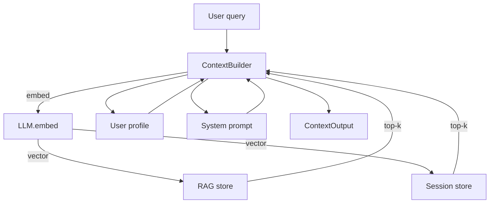

# protoprompt

> Layered context builder for LLM prompts: RAG + compressed session memory + user profile.

Production LLM apps hit the same wall: the model needs context, but the
context window is finite. Hand-rolled prompt assembly gets messy:
documents are queried separately from session history, the system prompt
gets duplicated, and you end up rewriting the same glue code per project.

`protoprompt` separates the three concerns and gives each a clean
protocol. The `ContextBuilder` orchestrates them; the result is a single
`system_prompt` plus a structured `ContextOutput` so the UI can show
provenance.

[Русская версия](/ru/)

## Why



Three composable layers, three pluggable contracts:

| Concern         | Protocol             | Default impl                       |
|-----------------|----------------------|------------------------------------|
| Vector storage  | `StoreProtocol`      | `InMemStore` (tests), `ChromaStore` |
| Compression     | `StrategyProtocol`   | `HeuristicStrategy`, `LLMSummaryStrategy` |
| Token counting  | `TokenCounter`       | `RegexTokenCounter`, `TiktokenCounter` |

## Features

- **RAG over documents** with top-k retrieval and metadata filters.
- **Session memory** that compresses old turns into a vector-friendly summary.
- **User profile** auto-derived from prior messages.
- **Token budget** that protects the model's context window.
- **Pluggable everything**: stores, strategies, token counters, even the
  LLM client (anything implementing `LLMClientProtocol` works).
- **Zero hard dependencies** — only `chromadb` / `tiktoken` are optional.

## Install

```bash
pip install protoprompt
pip install "protoprompt[chroma]"     # vector backend
pip install "protoprompt[tiktoken]"   # exact token counts
pip install "protoprompt[chroma,dev]" # everything for development
```

## Next steps

- [Quickstart](quickstart.md) — end-to-end example in 30 lines.
- [Concepts: context layers](concepts/context.md) — when to use what.
- [Concepts: token budget](concepts/budget.md) — protect your context window.
- [Concepts: compression](concepts/compression.md) — heuristic vs LLM-driven.
- [API Reference](api/context.md) — every public symbol.
