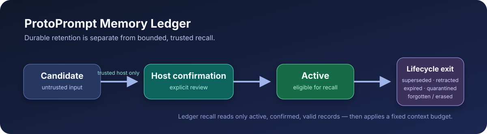

# Experimental memory ledger

The v0.10 ledger turns a durable memory from an unstructured vector chunk into
a scope-pinned record with an explicit lifecycle, immutable ingress provenance,
and a host-owned admission decision. It is deliberately **opt-in** and
experimental: it does not change `MemoryService`, profiles, session
compression, vector recall, or `ContextPlan` until a host explicitly installs
an adapter. In v0.11 that adapter can be the narrow experimental
`LedgerContextComposer` for admitted Ledger recall; it does not enable Ledger
globally or change legacy paths.

That separation is intentional. A PDF, tool result, transcript, or model
extraction must never become a trusted system-priority fact simply because it
was persisted.



## Quick start

Schema setup is an operator action, never an import-time side effect:

```python
from protoprompt.ledger import (
    MemoryAdmissionAction,
    MemoryAdmissionPolicy,
    MemoryKind,
    MemoryOrigin,
    MemoryReviewGate,
    MemoryWriter,
    SqliteMemoryLedger,
)
from protoprompt.scope import MemoryScope

ledger = SqliteMemoryLedger("memory-ledger.db")
print(ledger.dry_run_setup())  # no writes
ledger.setup()                 # explicit, idempotent ledger schema setup

writer = MemoryWriter(
    ledger,
    scope=MemoryScope(tenant="local", user="alice", thread="chat-42"),
)

# The host fixes authority-bearing ingress fields before untrusted text
# arrives. MemoryAdmissionPolicy() by itself quarantines every origin.
policy = MemoryAdmissionPolicy(
    policy_id="local-document-v1",
    policy_version="1",
    allowed_origins=(MemoryOrigin.DOCUMENT,),
    minimum_confidence=0.8,
)
gate = MemoryReviewGate(writer, origin=MemoryOrigin.DOCUMENT, policy=policy)
document_ingress = gate.ingress(
    kind=MemoryKind.PREFERENCE,
    source_ref="turn:42",          # host-minted opaque ID, not raw text
    evidence_refs=("turn:42:line:1",),
    confidence=0.9,
)
candidate = document_ingress.submit("The user prefers answers in Russian.")

# review() is pure; a sealed result is applied explicitly by trusted host code.
review = gate.review(candidate.record_id)
assert review.action is MemoryAdmissionAction.ALLOW
active = gate.confirm(review, event_id="admission:turn-42:allow")

assert writer.list_active() == [active]
```

`MemoryWriter` is constructed with one non-empty, host-owned `MemoryScope`.
Its mutation methods do not take a tenant, user, thread, lifecycle state, or
trust level. The lower-level `SqliteMemoryLedger` requires that same exact
scope on every operation. This is an API-shaping guard inside a trusted host
process, not a Python sandbox or authorization boundary: do not expose either
object to untrusted code.

## Admission boundary (v0.10)

`MemoryReviewGate` has one fixed scope, origin, policy, and actor. Its
`ingress()` creates a narrow host-configured endpoint: `submit(content)` is
the only variable input. The caller cannot choose scope, origin, kind,
confidence, source/evidence identifiers, lifecycle state, record ID, or event
ID. The closed origins are `user_input`, `document`, `tool_output`,
`model_extraction`, and `host_assertion`; `unknown` and `legacy_unknown` are
not reviewable origins.

`review()` does not write. It produces a sealed in-process `MemoryReview`;
only the creating gate can apply it. Its action maps exactly to one lifecycle
result: `allow` → `active`, `quarantine` → `quarantined`, and `reject` →
`forget()` with the payload removed. Every applied gate decision writes one
content-free `MemoryAdmissionAudit` paired with its lifecycle event. A
concrete-origin record cannot become recallable through `MemoryWriter.confirm`;
the raw confirmation API rejects it unless its origin is `unknown` or
`legacy_unknown`.

This is an API boundary inside a trusted host process, not a Python sandbox.
The model must receive a JSON/RPC tool schema with exactly `{ "content":
"..." }`; the host adapter derives scope, origin, source, policy, and action
outside the model. Never pass a `MemoryReviewGate`, `MemoryWriter`,
`SqliteMemoryLedger`, `MemoryReview`, or ingress object to arbitrary in-process
plugin code. If arbitrary plugins execute in the same process, isolate this
adapter behind a process/RPC boundary first.

The legacy raw writer remains a trusted-host compatibility and cleanup escape
hatch. `writer.propose()` / `writer.assert_candidate()` create `unknown`
provenance, and raw lifecycle cleanup does **not** create an admission audit.
Use it only for existing trusted integrations; it is not a model tool and is
not a strict-admission path.

## Lifecycle and recall

| State | How it gets there | Default recall |
|---|---|---|
| `candidate` | gate ingress, or legacy trusted raw writer | never |
| `active` | sealed gate `allow`, or legacy raw confirmation | only while valid and payload-present |
| `superseded` | explicit `supersede(old, replacement)` | never |
| `retracted` | `retract()` or `forget()` | never |
| `expired` | `expire()` / `expire_due()` | never |
| `quarantined` | sealed gate `quarantine()` or trusted cleanup | never |

Every lifecycle transition takes `expected_revision`; stale commands fail
instead of silently overwriting a newer decision. `forget()` records a
`forgotten` event and advances the revision even when a record was already
`retracted`, so payload removal invalidates stale cached projections while the
original `retracted_at` remains the time it first left recall.

A caller may retain an `event_id` across a retry. It is idempotent while the
original command remains addressable; a completed `forget()` retry returns its
stored erasure receipt. Replaying a candidate after its payload was forgotten,
or any command after a hard erase, is deliberately rejected rather than
resurrecting data. Reusing an ID for different input always raises a conflict.

For a concrete v5 origin, `list_active()` validates the matching immutable
`allow` audit, event payload, origin, revision, and reason before exposing a
record to recall. A malformed or missing audit fails closed. SQLite is still
not tamper-evident: a party that can directly alter the database, disable
triggers, and forge a self-consistent event can defeat an in-database audit.
Protect the database file and use an external signing/key-management boundary
when that threat is in scope.

Replacing a fact is explicit and deterministic:

```python
# ``new_active`` was admitted by its matching MemoryReviewGate above.
new = new_active
old = writer.supersede(
    old_active.record_id,
    replacement_record_id=new.record_id,
    expected_revision=old_active.revision,
    expected_replacement_revision=new.revision,
)
```

The replacement receives a typed `supersedes` relation in the same scope. No
cross-scope relation or implicit “latest wins” heuristic exists.

## Retention and deletion

The operational event history contains no plaintext memory, source ID,
evidence ID, or content fingerprint. Plaintext and opaque provenance live in a
separate local payload row; v4 setup explicitly scrubs the legacy creation
fingerprints written by earlier experimental schemas.

- `retract()` immediately excludes a record from recall but keeps that local
  payload for review.
- `forget()` moves it to `retracted`, deletes its local plaintext,
  source/evidence payload, source lookup entries, and relations, and redacts
  its stored content fingerprint. A content-free `forgotten` event and
  lifecycle receipt remain. It intentionally retains any content-free v5
  origin metadata and admission audit so a rejected decision can be audited.
- `forget_by_source("pdf:opaque-id")` is atomic for all currently linked
  records in the writer's exact scope. It also keeps a scoped opaque source
  tombstone, so that source cannot be ingested again in that scope; the same
  source ID remains independent in another scope.
- `erase()` is the explicit irreversible local escape hatch: it removes the
  record, payload, relations, v5 provenance/audits, and its event receipts. It
  also redacts links to that record from events owned by other records. It retains scoped opaque
  replay tombstones and its hard-erase receipt so an in-flight retry cannot
  resurrect the erased record ID; use a fresh record ID for a new memory.

This first slice has no external vector/FTS projection adapter. Therefore it
does not claim that `forget()` or `erase()` remove data from a separate vector
database; an adapter must provide durable deletion acknowledgement before
exposing that guarantee. Both operations affect live ledger rows, while SQLite
cannot promise erasure from historical backups, WAL/journal files, or physical
media. Use encryption/key destruction and a documented backup-retention policy
when that property matters.

## Safety boundaries

- Content is bounded to 16,000 characters; opaque IDs and references are
  bounded and cannot contain whitespace or raw multi-line text.
- `source_ref` and `evidence_refs` are host-minted provenance IDs. Do not put a
  filename, URL with secrets, prompt, or document body in them.
- `content_hash` is a scope-separated operational fingerprint, not a
  cryptographic audit or password primitive. It is redacted after `forget()`.
  The SQLite event log is not tamper-evident.
- `export()` excludes plaintext by default; use `include_content=True` only in
  an explicit, protected export flow.

## Migration and rollback

Use a dedicated ledger SQLite file by default. A ledger can share a file with
the tested legacy `SqliteStore` because it never imports `chunks`, profiles, or
session summaries automatically. Its table, explicit-index, and event-trigger
names are reserved rather than globally namespaced. There are no schema
extension points: `dry_run_setup()` and `setup()` accept only the exact
ledger-owned table/index definitions and reject external indexes or triggers
that target ledger tables, instead of adopting, overwriting, or silently
running them.

1. Run `dry_run_setup()` and back up the database with `ledger.backup(path)`.
2. Call `setup()` in an explicit migration job. v5 backfills only
   payload-bearing pre-v5 records as `legacy_unknown`; it never invents a
   modern origin or review audit. Pre-v5 active records remain recallable for
   compatibility.
3. A strict deployment must inventory those legacy active records, quarantine
   them through trusted lifecycle code, and re-ingest/review the data through
   a concrete v5 origin before enabling recall. Do not claim that a migrated
   legacy record passed v0.10 admission.
4. Keep legacy readers authoritative while evaluating a separate opt-in
   adapter or importer.
5. Roll back application traffic only by restoring a pre-upgrade backup into a
   separate database and returning traffic to the old components. v0.9 code
   rejects schema v5, so do not attempt an in-place or destructive downgrade
   of a shared database.

## Restart recovery

`MemoryReview` is deliberately process-local: after a restart a new gate
cannot replay a prior sealed review. Before applying an action, retain the
candidate `record_id` returned by `submit()` and your host-minted action
`event_id`. On recovery, use `writer.events(record_id)` and
`writer.admission_audits(record_id)`:

- a matching **admission** audit/event means the decision is final; do not
  re-review it;
- a concrete-origin admission lifecycle event without its matching audit is a
  corruption/atomicity alarm; stop;
- neither admission event nor audit while the concrete-origin record is still
  a candidate requires a new sealed review. A hard-erased record and its
  prior event IDs are terminal and must never be recreated.

Profile/session/vector importers, stable request composition, and bridges for
facts/episodes/procedures/RAG evidence remain future work. The experimental
`LedgerContextComposer` covers only the narrow admitted Ledger JSON → one
bounded request path; the ledger and its recall lane preserve all other public
behavior until migration contracts are separately proven.
