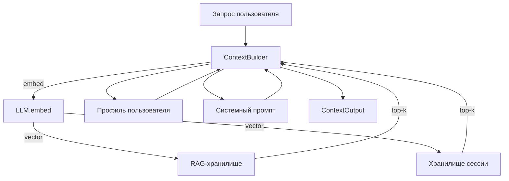

# protoprompt

> Слоистый сборщик контекста для LLM-промптов: RAG + сжатая память сессии + профиль пользователя.

[English version](/en/)

Прод-LLM-приложения упираются в одну и ту же стену: модели нужен контекст,
но окно конечно. Самописная сборка промпта превращается в кашу:
документы ищутся отдельно от истории сессии, system prompt дублируется,
и каждая команда переписывает один и тот же связующий код.

`protoprompt` разделяет три задачи и даёт каждой чистый протокол.
`ContextBuilder` оркестрирует их; результат — единый `system_prompt`
плюс структурированный `ContextOutput`, чтобы UI мог показать, откуда
пришёл каждый фрагмент.

## Зачем



Три компонуемых слоя, три подключаемых контракта:

| Задача                 | Протокол            | Реализация по умолчанию            |
|------------------------|---------------------|------------------------------------|
| Векторное хранилище    | `StoreProtocol`     | `InMemStore` (тесты), `ChromaStore` |
| Сжатие сессии          | `StrategyProtocol`  | `HeuristicStrategy`, `LLMSummaryStrategy` |
| Подсчёт токенов        | `TokenCounter`      | `RegexTokenCounter`, `TiktokenCounter` |

## Возможности

- **RAG по документам** с top-k-поиском и фильтрами по метаданным.
- **Память сессии**, сжимающая старые ходы в vector-friendly выжимку.
- **Профиль пользователя**, автоматически извлекаемый из прошлых сообщений.
- **Токен-бюджет**, защищающий контекстное окно модели.
- **Подключаемость всего**: хранилищ, стратегий, счётчиков токенов,
  даже LLM-клиента (подойдёт всё, что реализует `LLMClientProtocol`).
- **Нулевые жёсткие зависимости** — опционально только `chromadb` и `tiktoken`.

## Установка

```bash
pip install protoprompt
pip install "protoprompt[chroma]"     # векторный бэкенд
pip install "protoprompt[tiktoken]"   # точные подсчёты токенов
pip install "protoprompt[chroma,dev]" # всё для разработки
```

## Дальше

- [Быстрый старт](quickstart.md) — рабочий пример в 30 строк.
- [Обучение: память в LLM-приложениях](tutorials/index.md) — курс для
  новичков: пять проектов от простого к сложному.
- [Профиль пользователя](profile.md) — долговременная память о человеке.
- [Концепции: слои контекста](concepts/context.md) — что и когда включать.
- [Концепции: токен-бюджет](concepts/budget.md) — защита контекстного окна.
- [Концепции: сжатие сессии](concepts/compression.md) — эвристика против LLM-стратегии.
- [API Reference](api/context.md) — все публичные символы.
